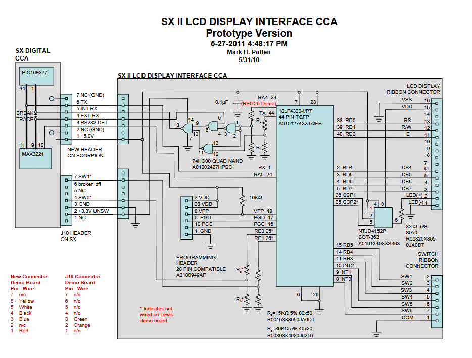

# Sx_II_LCD_Interface 
Implement an LCD display on an RS-232 command stream from a device  
This code is provided as an example of a firmware coding project, implemented by Mark Patten c. 2011 
(Originally from a work project, sanitized to remove project names and sensitive information) 
C code implemented on a PIC 18LF4320 microcontroller 
The Sx_II_LCD_Interface reads an RS-232 stream of proprietary information from a hardware device and displays information on an LCD display 
 
